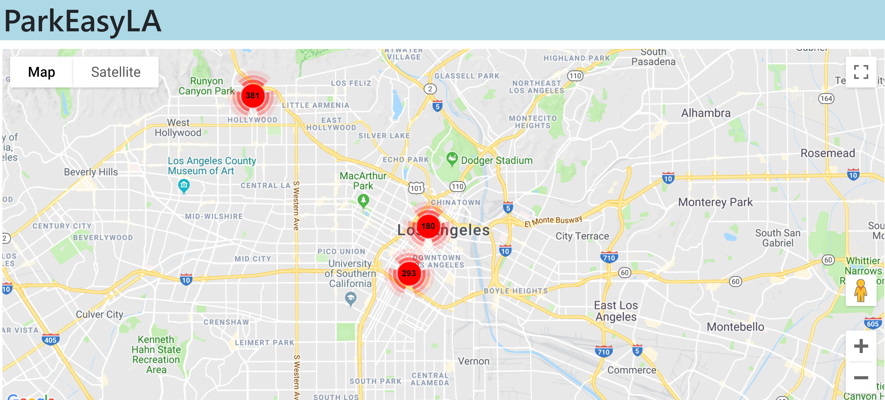
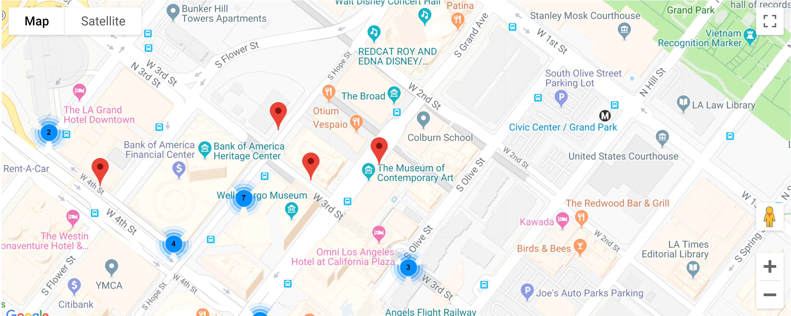

# ParkEasyLA
A web application that shows users available parking meters to park at in 
Los Angeles, CA. Users can select any available parking meter and get directions
from their current location. Users can also view additional information 
regarding these parking meters, including, but not limited to, pricing, hours 
of operation, and street cleaning hours.

## Screenshots

Landing Page: 
Vacant Parking Meter Spots: 
Parking Meter Info: 
Directions from User's Current Location to Parking Meter: 

## Technologies Used
- Python
- JavaScript
- Flask
- HTML
- CSS
- Google Maps API
- Socrata API

## What I Learned
- Familiarity with the Google Maps Directions API
- Familiarity with the Socrata API
- Using PostgreSQL as a database

## License
[MIT](https://choosealicense.com/licenses/mit/)

## Project Status
Features to add in the future:
1. Integrate parking availability of parking garages.
2. Integrate parking availability of free sidewalk parking.
3. Include parking availability forecasting for each location.
4. Show probability of parking spot availability at a certain time and date.
5. Develop a companion mobile app for iOS and Android.
6. Add other cities as data becomes available.

## FAQ
**Q: Where is the parking availability data sourced from?** 
A: Parking data is sourced from <a href="data.lacity.org">data.lacity.org</a>

**Q: I am unable to get directions from my current location. How do I fix this?** 
A: You will need to enable location services in your web browser. If you are 
using Google Chrome, instructions to enable your location can be found [here](https://support.google.com/chrome/answer/142065?co=GENIE.Platform%3DDesktop&hl=en).